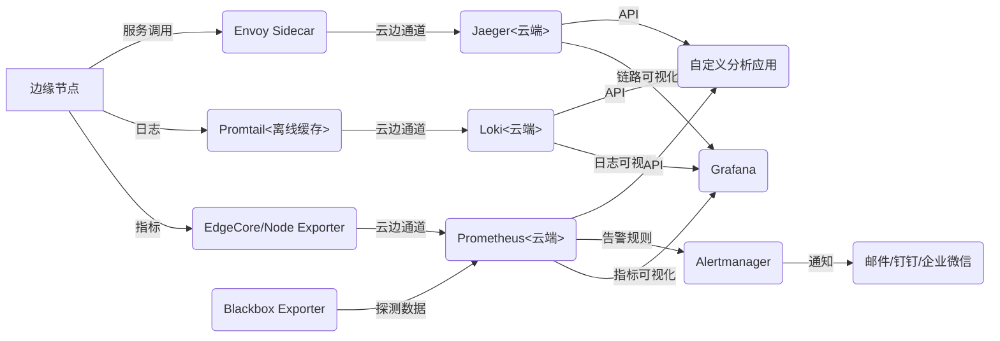

# k3s+KubeEdge+KubeMesh 云边协同可观测性完整解决方案
该方案面向k3s+KubeEdge+KubeMesh的云边协同场景，构建**指标监控、日志管理、链路追踪、告警体系**四位一体的可观测性平台，同时支持**新项目一键部署复用**和**自定义API开发集成**，兼顾边缘场景的轻量化、离线容错特性与云端的聚合分析能力。

## 一、整体架构设计
### 1. 核心组件选型与部署策略
遵循**云端聚合、边缘轻量**的原则，组件部署位置与核心作用如下：

| 功能维度       | 核心组件组合                          | 部署位置       | 关键特性                                                                 |
|----------------|---------------------------------------|----------------|--------------------------------------------------------------------------|
| 指标监控       | Prometheus + Grafana + Node Exporter  | 云端（核心）+ 边缘（轻量采集） | 云边节点/组件指标采集，多维数据可视化，适配k3s轻量化特性                  |
| 日志管理       | Loki + Promtail                       | 云端（聚合）+ 边缘（采集缓存） | 标签化日志存储，边缘离线缓存，与Grafana无缝联动                          |
| 链路追踪       | KubeMesh（Istio/Envoy）+ Jaeger       | 云端（存储）+ 边缘（Sidecar注入） | 无代码侵入的全链路追踪，云边调用链可视化，边缘离线数据缓存              |
| 通信链路监控   | Blackbox Exporter + Prometheus        | 云端           | 主动探测云边链路连通性、延迟、丢包率                                    |
| 告警体系       | Prometheus Alertmanager + 通知渠道（邮件/钉钉/企业微信） | 云端           | 多维度告警规则，分级通知，边缘异常及时触达                              |

### 2. 数据流转流程


## 二、标准化部署方案（支持新项目一键复用）
针对新集群部署，提供**基础脚本方案**（中小规模集群）和**进阶Helm Chart方案**（企业级/大规模集群），实现配置标准化与一键复用。

### 1. 基础方案：配置归档+一键部署脚本
#### （1）目录结构标准化
将所有配置文件、Helm参数文件归档为统一目录，便于跨集群复制：
```
k3s-edge-observability/
├── 00-env.yaml          # 环境差异化配置（节点标签、存储大小等）
├── 01-namespace.yaml    # monitoring命名空间配置
├── 02-prometheus/       # Prometheus/Grafana配置
│   ├── values.yaml      # kube-prometheus-stack自定义参数
│   └── scrape-config.yaml  # KubeEdge/边缘节点指标抓取配置
├── 03-loki/             # Loki+Promtail配置
│   ├── loki-values.yaml
│   └── promtail-values.yaml
├── 04-jaeger/           # Jaeger配置
│   └── jaeger-values.yaml
├── 05-kubemesh/         # KubeMesh链路追踪配置
│   └── istio-tracing.yaml
├── 06-blackbox/         # Blackbox Exporter配置
│   ├── values.yaml
│   └── probe-config.yaml
├── 07-alertmanager/     # 告警配置
│   └── alert-rules.yaml
└── deploy.sh            # 一键部署脚本
```

#### （2）一键部署脚本编写
将所有Helm安装、配置应用命令整合，实现自动化部署（`deploy.sh`）：
```bash
#!/bin/bash
set -e  # 出错停止执行

# 加载环境配置（可根据集群修改00-env.yaml中的变量）
source ./00-env.yaml

# 1. 创建命名空间
kubectl apply -f 01-namespace.yaml

# 2. 添加Helm仓库并更新
helm repo add prometheus-community https://prometheus-community.github.io/helm-charts
helm repo add grafana https://grafana.github.io/helm-charts
helm repo add jaegertracing https://jaegertracing.github.io/helm-charts
helm repo update

# 3. 部署Prometheus+Grafana+Alertmanager
helm install -n monitoring kube-monitor prometheus-community/kube-prometheus-stack \
  -f 02-prometheus/values.yaml --version ${PROMETHEUS_CHART_VERSION}
kubectl apply -f 02-prometheus/scrape-config.yaml
kubectl apply -f 07-alertmanager/alert-rules.yaml

# 4. 部署Loki+Promtail
helm install -n monitoring loki grafana/loki \
  -f 03-loki/loki-values.yaml --version ${LOKI_CHART_VERSION}
helm install -n monitoring promtail grafana/promtail \
  -f 03-loki/promtail-values.yaml --set "loki.serviceName=loki" --version ${PROMTAIL_CHART_VERSION}

# 5. 部署Jaeger
helm install -n monitoring jaeger jaegertracing/jaeger \
  -f 04-jaeger/jaeger-values.yaml --version ${JAEGER_CHART_VERSION}

# 6. 部署Blackbox Exporter
helm install -n monitoring blackbox-exporter prometheus-community/prometheus-blackbox-exporter \
  -f 06-blackbox/values.yaml --version ${BLACKBOX_CHART_VERSION}
kubectl apply -f 06-blackbox/probe-config.yaml

# 7. 配置KubeMesh链路追踪
kubectl apply -f 05-kubemesh/istio-tracing.yaml

echo "可观测性平台部署完成！"
echo "Grafana端口转发：kubectl port-forward svc/kube-monitor-grafana -n monitoring 3000:80"
echo "Jaeger端口转发：kubectl port-forward svc/jaeger-query -n monitoring 16686:16686"
```

#### （3）环境差异化处理
在`00-env.yaml`中定义集群特有变量，避免硬编码，示例：
```bash
# 00-env.yaml
# Chart版本锁定（避免兼容性问题）
PROMETHEUS_CHART_VERSION="50.3.1"
LOKI_CHART_VERSION="5.37.0"
PROMTAIL_CHART_VERSION="6.37.0"
JAEGER_CHART_VERSION="0.105.0"
BLACKBOX_CHART_VERSION="7.1.0"

# 边缘节点标签（根据实际集群修改）
EDGE_NODE_LABEL="node-role.kubernetes.io/edge"

# 存储大小（根据集群资源调整）
PROMETHEUS_STORAGE_SIZE="50Gi"
LOKI_STORAGE_SIZE="100Gi"
```

#### （4）新集群一键复用
将目录包复制到新集群节点，执行以下命令即可完成部署：
```bash
# 赋予脚本执行权限
chmod +x deploy.sh
# 一键部署
./deploy.sh
```

### 2. 进阶方案：自定义Helm Chart封装
适用于企业级大规模集群，支持版本管理、参数动态调整：
1. **创建父Chart**：将所有组件作为依赖添加到`Chart.yaml`，统一管理版本和参数。
2. **统一配置**：在`values.yaml`中定义所有组件的参数（如边缘节点标签、资源限制、采样率）。
3. **部署命令**：`helm install -n monitoring k3s-edge-observability ./k3s-edge-observability`。

### 3. 部署验证
执行以下命令验证组件状态，确保所有Pod处于`Running`状态：
```bash
kubectl get pods -n monitoring
```

## 三、核心功能实现
### 1. 指标监控：覆盖云边节点与组件
#### （1）关键配置：KubeEdge指标抓取
在`scrape-config.yaml`中添加KubeEdge云端和边缘指标抓取任务：
```yaml
apiVersion: v1
kind: ConfigMap
metadata:
  name: kube-monitor-kube-prometheus-prometheus-scrape-config
  namespace: monitoring
data:
  additional-scrape-configs.yaml: |
    # 抓取CloudCore指标
    - job_name: 'kubeedge-cloudcore'
      static_configs:
        - targets: ['cloudcore:10250']
      metrics_path: '/metrics'
    # 抓取EdgeCore指标（仅边缘节点）
    - job_name: 'kubeedge-edgecore'
      kubernetes_sd_configs:
        - role: node
      relabel_configs:
        - source_labels: [__meta_kubernetes_node_label_${EDGE_NODE_LABEL}]
          regex: "true"
          action: keep
        - source_labels: [__address__]
          regex: '(.*):10250'
          replacement: '${1}:10000'
          target_label: __address__
    # 抓取KubeMesh(Istio)指标
    - job_name: 'kubemesh-istiod'
      static_configs:
        - targets: ['istiod.istio-system.svc:15014']
```

#### （2）Grafana可视化
- 导入预定义仪表盘：K3s集群（ID 315）、KubeEdge（ID 11863）、KubeMesh(Istio)（ID 7639）。
- 核心监控指标：云边链路连接状态、边缘节点CPU/内存使用率、KubeMesh服务调用成功率。

### 2. 日志管理：边缘离线缓存与云端聚合
#### （1）边缘节点日志采集优化
在`promtail-values.yaml`中配置离线缓存，避免边缘离线时日志丢失：
```yaml
promtail:
  # 仅在边缘节点部署
  nodeSelector:
    ${EDGE_NODE_LABEL}: "true"
  # 轻量化资源限制
  resources:
    requests:
      memory: 32Mi
      cpu: 50m
    limits:
      memory: 64Mi
      cpu: 100m
  # 离线缓存配置
  config:
    clients:
      - url: http://loki:3100/loki/api/v1/push
        backoff_config:
          max_period: 10m  # 最大重试间隔
          max_retries: 20   # 最大重试次数
    positions:
      filename: /var/log/promtail/positions.yaml
    target_config:
      cache:
        path: /var/log/promtail/cache
        max_size: 100MB  # 边缘节点缓存大小
```

#### （2）日志查询：LogQL语法
在Grafana中使用LogQL查询边缘节点日志，示例：
- 查询`edgecore`应用日志：`{app="edgecore"}`
- 查询边缘节点`node-1`的错误日志：`{node="node-1"} |= "error"`

### 3. 链路追踪：基于KubeMesh的无代码侵入方案
#### （1）KubeMesh追踪配置
在`istio-tracing.yaml`中启用追踪并适配边缘节点：
```yaml
apiVersion: install.istio.io/v1alpha1
kind: IstioOperator
metadata:
  name: istio-tracing
  namespace: istio-system
spec:
  meshConfig:
    # 启用分布式追踪
    enableTracing: true
    defaultConfig:
      tracing:
        sampling: 10.0  # 边缘场景采样率10%（测试环境可设100%）
        zipkin:
          address: jaeger-collector.monitoring.svc:9411  # Jaeger兼容Zipkin协议
  # 边缘节点Sidecar资源限制
  values:
    global:
      proxy:
        nodeSelector:
          ${EDGE_NODE_LABEL}: "true"
        resources:
          requests:
            cpu: 10m
            memory: 16Mi
          limits:
            cpu: 100m
            memory: 128Mi
```

#### （2）Sidecar自动注入
为业务命名空间添加标签，实现Envoy Sidecar自动注入：
```bash
kubectl label namespace edge-apps istio-injection=enabled
# 重启应用使配置生效
kubectl rollout restart deployment -n edge-apps
```

#### （3）链路可视化
通过Jaeger UI查看云边服务调用链：`kubectl port-forward svc/jaeger-query -n monitoring 16686:16686`，浏览器访问`http://localhost:16686`。

### 4. 通信链路监控：Blackbox Exporter主动探测
#### （1）探测配置
在`probe-config.yaml`中添加云边链路探测任务：
```yaml
apiVersion: v1
kind: ConfigMap
metadata:
  name: blackbox-config
  namespace: monitoring
data:
  blackbox.yml: |
    modules:
      tcp_connect:
        prober: tcp
        timeout: 5s
      http_2xx:
        prober: http
        timeout: 5s
---
# Prometheus抓取Blackbox数据
apiVersion: v1
kind: ConfigMap
metadata:
  name: blackbox-scrape-config
  namespace: monitoring
data:
  additional-scrape-configs.yaml: |
    - job_name: 'kubeedge-link-monitor'
      metrics_path: /probe
      params:
        module: [tcp_connect]  # 探测TCP连通性
      static_configs:
        - targets:
          - cloudcore:10000  # CloudCore EdgeHub端口
          - edge-node-1:10000  # 边缘节点1
          - edge-node-2:10000  # 边缘节点2
      relabel_configs:
        - source_labels: [__address__]
          target_label: __param_target
        - source_labels: [__param_target]
          target_label: instance
        - target_label: __address__
          replacement: blackbox-exporter:9115  # Blackbox服务地址
```

#### （2）核心指标
通过Prometheus查询链路状态：
- 连通性：`probe_success{job="kubeedge-link-monitor"}`（0=失败，1=成功）
- 延迟：`probe_duration_seconds{job="kubeedge-link-monitor"}`

### 5. 告警体系：Prometheus Alertmanager
#### （1）告警规则配置
在`alert-rules.yaml`中定义核心告警规则，示例：
```yaml
apiVersion: monitoring.coreos.com/v1
kind: PrometheusRule
metadata:
  name: kubeedge-alert-rules
  namespace: monitoring
spec:
  groups:
  - name: kubeedge.rules
    rules:
    # 边缘节点离线告警
    - alert: EdgeNodeDisconnected
      expr: probe_success{job="kubeedge-link-monitor"} == 0
      for: 5m
      labels:
        severity: critical
      annotations:
        summary: "边缘节点 {{ $labels.instance }} 与云端断开连接"
        description: "边缘节点已断开连接5分钟，请检查网络或EdgeCore状态"
    # 链路延迟过高告警
    - alert: KubeEdgeLinkHighLatency
      expr: probe_duration_seconds{job="kubeedge-link-monitor"} > 1.0
      for: 1m
      labels:
        severity: warning
      annotations:
        summary: "云边链路 {{ $labels.instance }} 延迟过高"
        description: "链路延迟达到 {{ $value }} 秒，超过阈值1秒"
    # KubeMesh服务调用失败告警
    - alert: KubeMeshServiceCallFailed
      expr: sum(istio_requests_total{response_code=~"5..", job="kubemesh-istiod"}) / sum(istio_requests_total{job="kubemesh-istiod"}) > 0.05
      for: 2m
      labels:
        severity: critical
      annotations:
        summary: "KubeMesh服务调用失败率过高"
        description: "失败率达到 {{ $value | humanizePercentage }}，超过阈值5%"
```

#### （2）通知渠道配置
修改Alertmanager配置，添加邮件、钉钉等通知渠道，示例（钉钉）：
```yaml
# alertmanager-config.yaml
apiVersion: v1
kind: Secret
metadata:
  name: kube-monitor-kube-prometheus-alertmanager
  namespace: monitoring
stringData:
  alertmanager.yaml: |
    global:
      resolve_timeout: 5m
    route:
      group_by: ['alertname']
      group_wait: 10s
      group_interval: 10s
      repeat_interval: 1h
      receiver: 'dingding'
    receivers:
    - name: 'dingding'
      webhook_configs:
      - url: 'https://oapi.dingtalk.com/robot/send?access_token=你的钉钉机器人token'
        send_resolved: true
```

## 四、API集成与自定义应用开发
所有组件均提供标准API，可脱离Grafana开发自定义分析应用，实现数据的二次加工与展示。

### 1. 核心组件API详情
| 组件       | API基础地址                          | 常用接口与用途                                                                 |
|------------|-------------------------------------|------------------------------------------------------------------------------|
| Prometheus | `http://<prometheus-svc>:9090/api/v1` | `/query`（即时指标查询）、`/query_range`（范围指标查询）、`/alerts`（告警状态查询） |
| Loki       | `http://<loki-svc>:3100/api/v1`     | `/query`（日志查询）、`/labels`（日志标签查询）、`/series`（日志序列查询）|
| Jaeger     | `http://<jaeger-query-svc>:16686/api` | `/services`（服务列表）、`/traces`（追踪数据查询）、`/dependencies`（服务依赖）|
| Alertmanager | `http://<alertmanager-svc>:9093/api/v1` | `/alerts`（告警列表）、`/silences`（静默规则管理）|

### 2. API使用示例
#### （1）Prometheus指标查询
```bash
# 查询当前边缘节点连接数
curl 'http://kube-monitor-kube-prometheus-prometheus:9090/api/v1/query?query=kubeedge_cloudhub_connected_nodes'

# 查询过去1小时的边缘节点CPU使用率
curl 'http://kube-monitor-kube-prometheus-prometheus:9090/api/v1/query_range?query=edge_node_cpu_usage_seconds_total&start=2025-05-01T00:00:00Z&end=2025-05-01T01:00:00Z&step=60s'
```

#### （2）Loki日志查询
```bash
# 查询过去1小时的edgecore日志
curl -G 'http://loki:3100/api/v1/query' \
  --data-urlencode 'query={app="edgecore"}' \
  --data-urlencode 'start=2025-05-01T00:00:00Z' \
  --data-urlencode 'end=2025-05-01T01:00:00Z'
```

#### （3）Jaeger链路查询
```bash
# 查询服务列表
curl 'http://jaeger-query:16686/api/services'

# 查询edge-app的追踪数据
curl -G 'http://jaeger-query:16686/api/traces' \
  --data-urlencode 'service=edge-app' \
  --data-urlencode 'start=1746048000' \
  --data-urlencode 'end=1746051600'
```

### 3. 自定义应用开发建议
1. **统一API网关**：部署Nginx/Kong作为API网关，将所有组件API统一暴露，避免前端应用直接访问多个服务地址。
2. **认证与授权**：为API添加Basic Auth/OAuth2认证（如Prometheus配置basic auth），确保数据安全。
3. **数据关联分析**：根据追踪ID关联对应的日志和指标（如Jaeger的trace ID可作为日志标签，实现链路+日志联动）。
4. **SDK使用**：利用各组件的官方SDK（如Prometheus Python SDK、Loki Go SDK）简化开发。

## 五、最佳实践与优化建议
### 1. 资源优化（边缘节点重点）
- 边缘节点组件（Promtail、Envoy Sidecar）资源限制控制在**内存64Mi以内，CPU100m以内**。
- Prometheus采样间隔从15s调整为30s，减少边缘节点数据上报压力。
- Loki使用`boltdb-shipper`存储模式，降低云端存储资源消耗。

### 2. 边缘场景适配
- 开启EdgeCore的`edgeStream`功能，支持云端直接查询边缘节点日志。
- Promtail配置本地缓存，边缘离线时日志缓存至本地，重连后自动上报。
- Jaeger Agent配置本地缓存，边缘离线时追踪数据缓存至本地，避免丢失。

### 3. 安全加固
- 为Grafana/Jaeger配置HTTPS，使用Ingress暴露服务（而非端口转发）。
- 限制Prometheus/Loki的API访问范围，仅允许内网和自定义应用访问。
- 定期清理监控数据（如Prometheus保留15天数据，Loki保留30天数据）。

### 4. 运维建议
- 部署前在测试环境验证边缘离线恢复场景，确保数据不丢失。
- 根据业务流量调整KubeMesh追踪采样率（生产环境建议5%-10%）。
- 配置告警静默规则，避免节假日或维护期间的无效告警。

## 六、总结
本解决方案为k3s+KubeEdge+KubeMesh场景提供了**一站式可观测性能力**，核心要点如下：
1. **部署标准化**：通过配置归档+脚本或自定义Helm Chart，实现新集群一键部署复用，解决环境差异化问题。
2. **功能全覆盖**：指标、日志、链路、告警四位一体，适配边缘场景的轻量化和离线容错特性。
3. **开放集成**：所有组件提供标准API，支持自定义分析应用开发，脱离Grafana实现数据深度利用。
4. **优化适配**：针对边缘节点资源受限的特点，进行资源限制和缓存配置，确保系统稳定运行。
-------------
# 任务说明

上文是我整理了一个我们这个场景k3s+kubeedge+kubemesh，可观测性解决方案，我希望离线部署的时候，就能预先导入相关镜像，已经准备好了helm包，所以在这个项目中涉及几方面的工作
1、新增一个GitHubAction 文件，参考其他action，专门处理可观测性需要的镜像、二进制文件、helm等需要提前下载的内容
2、分别编写云端控制平台上可观测性的安装脚本，边端如果有需要也需要一份脚本
3、检查以前的安装脚本，可按是否在安装的时候还需要提供新的配置，比如配置edgecore的配置文件开放接口之类的

注意，当前设计方案用的组件版本，链接都不一定正确，你需要查询github 获取最新匹配的稳定版本，决定需要下载的容器heml包等版本号之类的信息